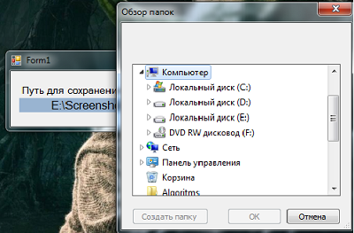

## ScreenshotApplication - Windows Forms Application
Designed to save the screenshot taken to a user-specified folder

### For example: 

When the user presses the ***PrintScreen*** key, the program will automatically receive the screenshot taken from the ***clipboard*** and save it to the ***specified path***
